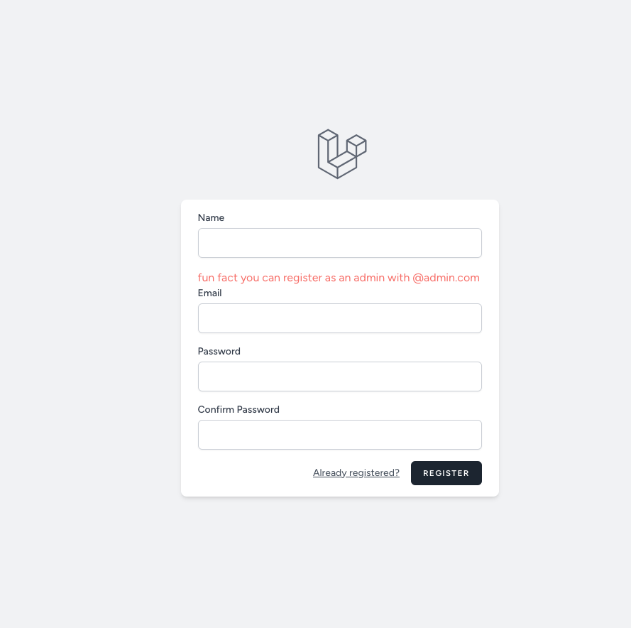
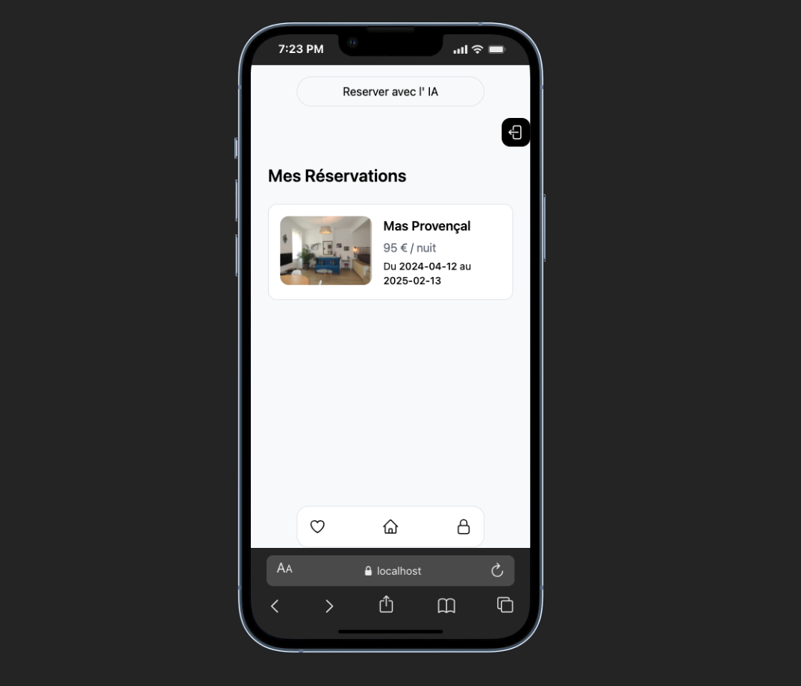
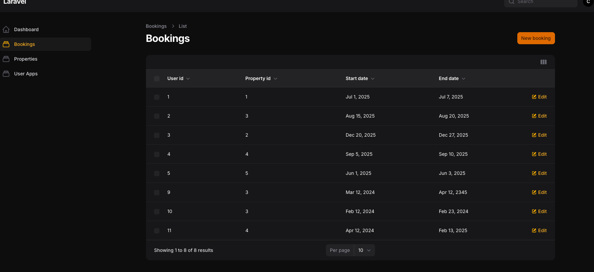
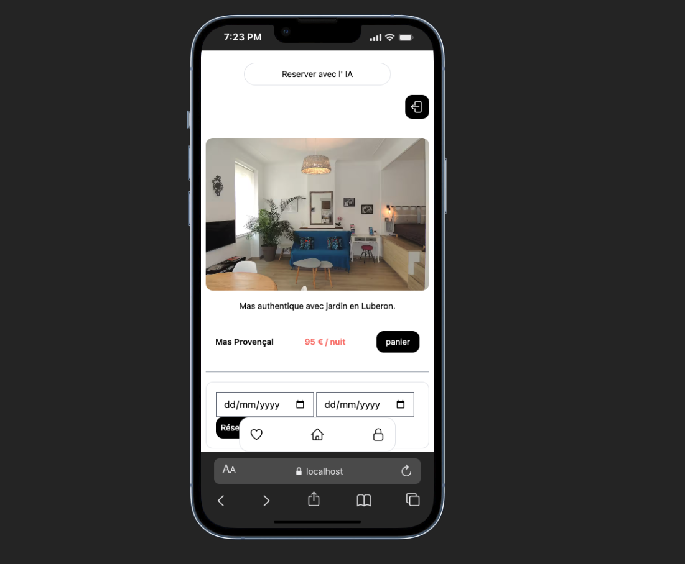

<p align="center"><a href="https://laravel.com" target="_blank"></a></p>

<p align="center">
<a href="https://github.com/laravel/framework/actions"></a>
<a href="https://packagist.org/packages/laravel/framework"></a>
<a href="https://packagist.org/packages/laravel/framework"></a>
<a href="https://packagist.org/packages/laravel/framework"></a>
</p>

# Laravel Test - Application de Réservation Immobilière

## 📋 Présentation

Application de gestion de réservations immobilières développée avec Laravel, Filament, Blade et TailwindCSS.

---

## ⚙️ Prérequis

- PHP 8.1+
- Composer
- Node.js & NPM
- Git

> Le projet utilise **SQLite** par défaut, aucune installation de MySQL n'est nécessaire.

---

## 🚀 Installation
```bash
git clone https://github.com/arobaseSuulei/laravel-test.git
cd laravel-test
composer install
npm install && npm run build
cp .env.example .env
php artisan key:generate
touch database/database.sqlite
php artisan migrate
php artisan db:seed --class=TestSeeder
php artisan serve
```

L'application est accessible sur `http://localhost:8000`


---

## 📱 Responsive Design

L'application est entièrement responsive et optimisée pour mobile et desktop.


### Points clés du responsive :
- Navigation mobile avec barre fixe en bas de page
- Navigation desktop avec navbar centrée en haut
- Grille de propriétés : 2 colonnes sur mobile, 4 sur desktop
- Page détail : image + carte côte à côte sur mobile, image pleine largeur sur desktop
- Formulaire de réservation adapté selon la taille d'écran

### Points clés du responsive :
- Navigation mobile avec barre fixe en bas de page
- Navigation desktop avec navbar centrée en haut
- Grille de propriétés : 2 colonnes sur mobile, 4 sur desktop
- Page détail : image + carte côte à côte sur mobile, image pleine largeur sur desktop
- Formulaire de réservation adapté selon la taille d'écran
---

## Captures d'écran

### Authentification


### homepage mobile


### Réservation


### Administration Filament


### formulaire de reservation


---
## 🗂️ Structure du projet

### Modèles
- **User** — utilisateurs gérés par Laravel Breeze
- **Property** — biens immobiliers (nom, description, prix par nuit, image)
- **Booking** — réservations (user, property, date début, date fin)

### Routes principales
| Route | Description |
|-------|-------------|
| `/` | Liste des propriétés |
| `/index/{id}` | Détail d'une propriété |
| `/reservations` | Mes réservations (auth requis) |
| `/booking/{id}` | Créer une réservation (auth requis) |
| `/admin` | Panel Filament (admin uniquement) |
| `/login` | Connexion |
| `/register` | Inscription |

---

## 🔐 Authentification

L'authentification est gérée par **Laravel Breeze**. Tout le monde peut consulter les propriétés, mais il faut être connecté pour réserver.

---

## 🛠️ Panel d'administration Filament

Accessible sur `/admin`. Réservé aux comptes dont l'email se termine par `@admin.com`.

Pour créer un compte admin :
```bash
php artisan make:filament-user
```
Utilisez un email en `@admin.com`.

Le panel permet de gérer :
- Les propriétés (CRUD complet)
- Les réservations
- Les utilisateurs

---

## 🧰 Technologies utilisées

- **Laravel 12**
- **Laravel Breeze** — authentification
- **Filament v5** — panel d'administration
- **TailwindCSS v4** — styles
- **SQLite** — base de données

---
## 🚀 Next step

Intégrer un LLM qui permettra aux utilisateurs de réserver des propriétés rien qu'en parlant à notre IA

<video src="https://private-user-images.githubusercontent.com/145722801/558875746-c4e35054-438c-494c-ae04-d502ecd920f2.mp4?jwt=eyJ0eXAiOiJKV1QiLCJhbGciOiJIUzI1NiJ9.eyJpc3MiOiJnaXRodWIuY29tIiwiYXVkIjoicmF3LmdpdGh1YnVzZXJjb250ZW50LmNvbSIsImtleSI6ImtleTUiLCJleHAiOjE3NzI3MzQwMzcsIm5iZiI6MTc3MjczMzczNywicGF0aCI6Ii8xNDU3MjI4MDEvNTU4ODc1NzQ2LWM0ZTM1MDU0LTQzOGMtNDk0Yy1hZTA0LWQ1MDJlY2Q5MjBmMi5tcDQ_WC1BbXotQWxnb3JpdGhtPUFXUzQtSE1BQy1TSEEyNTYmWC1BbXotQ3JlZGVudGlhbD1BS0lBVkNPRFlMU0E1M1BRSzRaQSUyRjIwMjYwMzA1JTJGdXMtZWFzdC0xJTJGczMlMkZhd3M0X3JlcXVlc3QmWC1BbXotRGF0ZT0yMDI2MDMwNVQxODAyMTdaJlgtQW16LUV4cGlyZXM9MzAwJlgtQW16LVNpZ25hdHVyZT02MjJjY2ViMTMwYjQzMWE0NTA0OWI0YzZmYTg0NmZiMjk5OTFkMjFmNWUyMDdmZmRhNjBhNDk2Mzg5YWNkOWIyJlgtQW16LVNpZ25lZEhlYWRlcnM9aG9zdCJ9.ZBLfxVcFnWcFjaieLB_9SddqdV4Tv1A4OwBeXVjl8wY" controls width="100%"></video>
